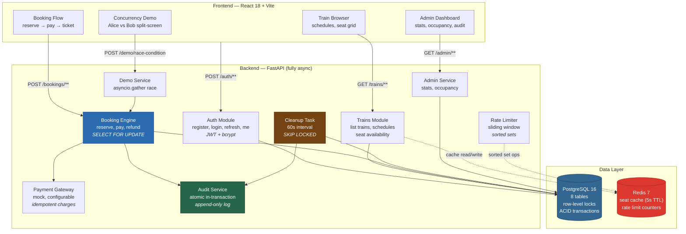
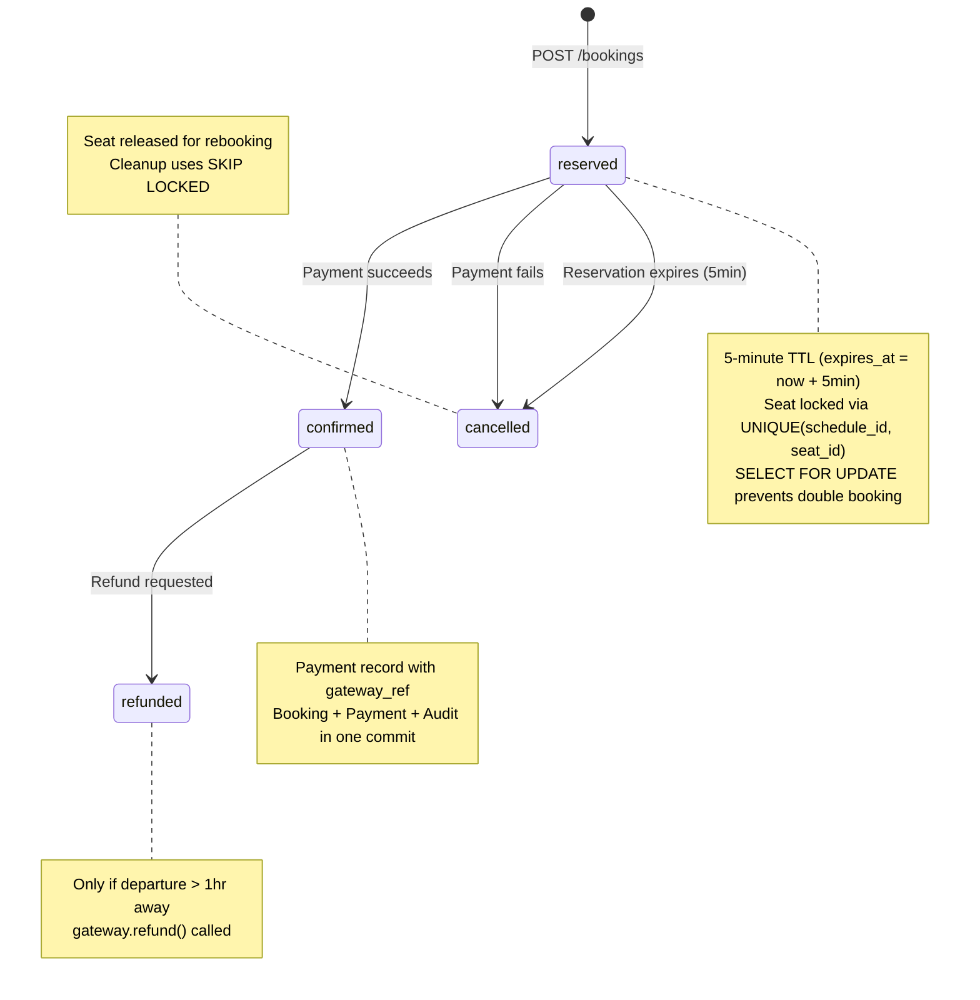
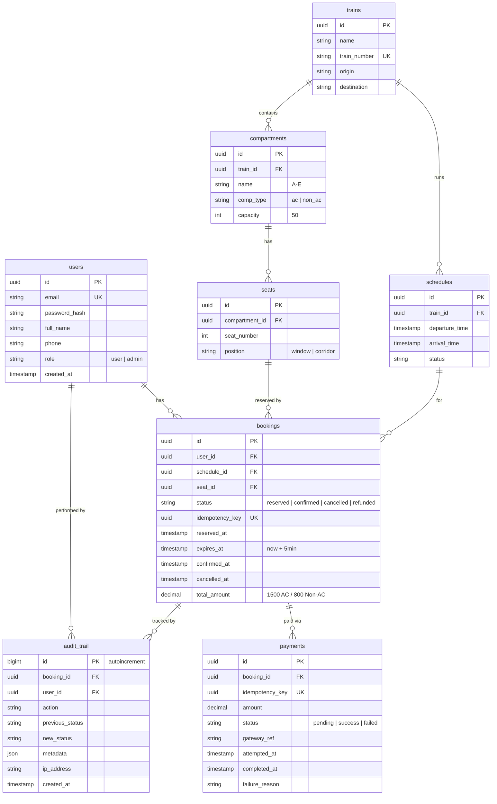
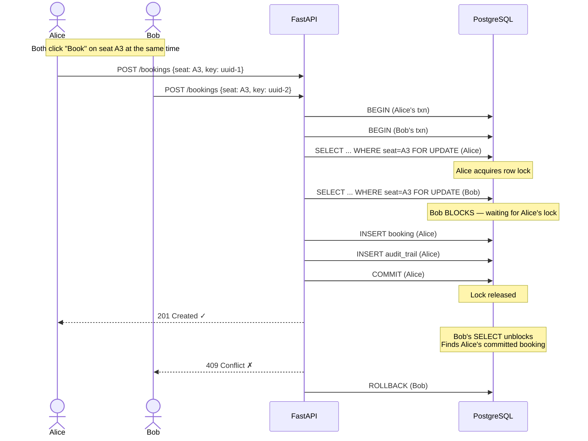
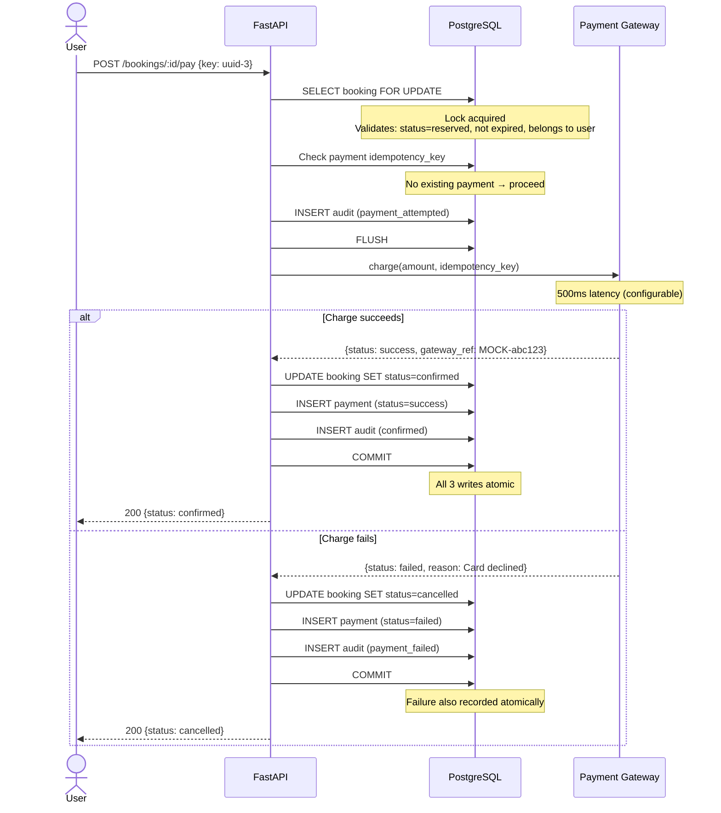
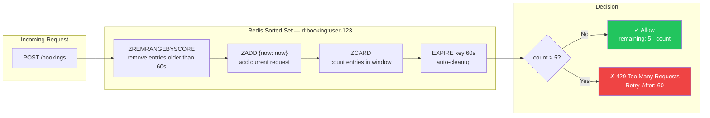
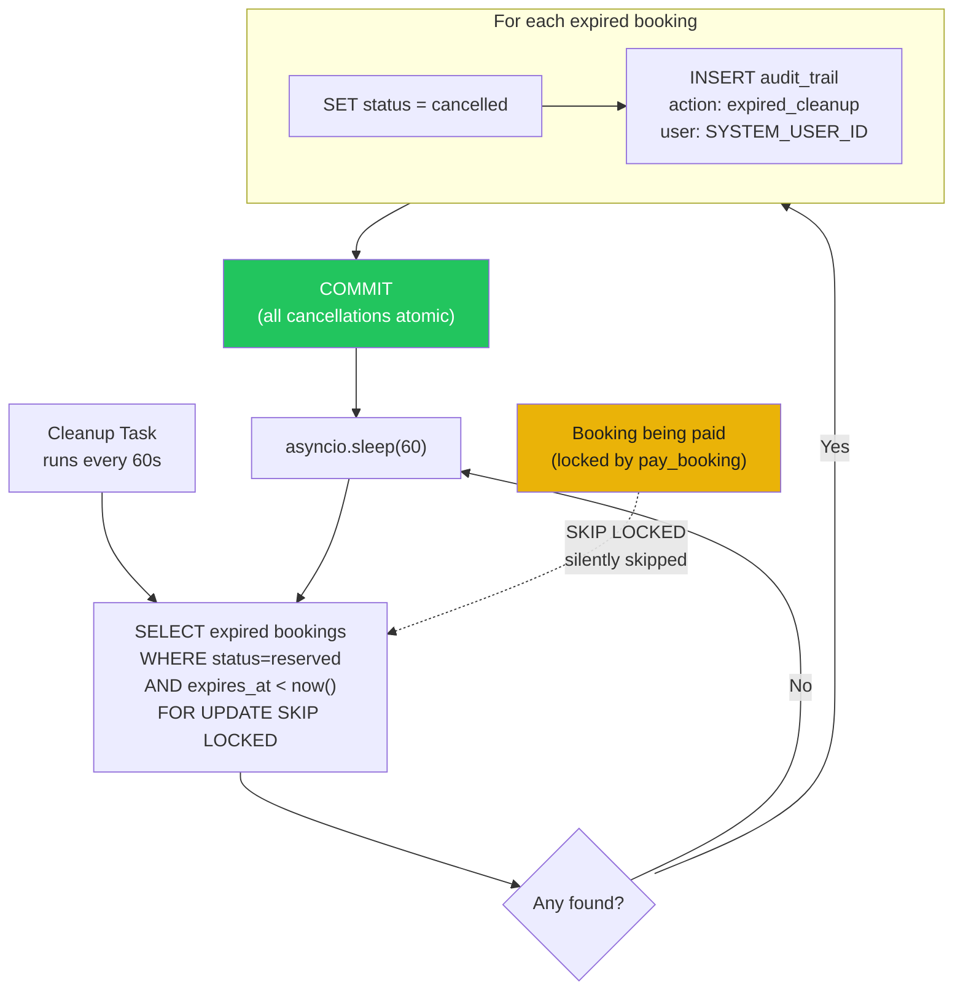
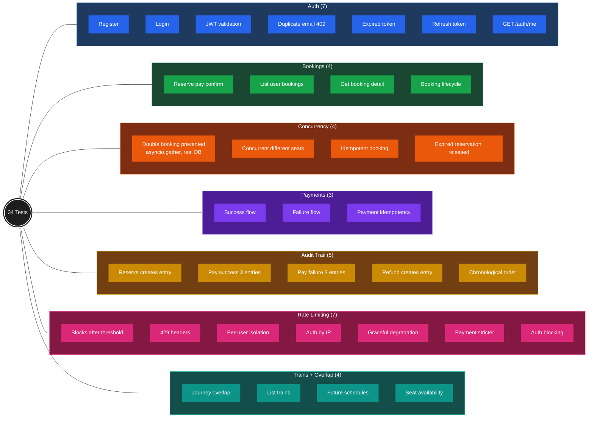

# RailBook Mermaid Diagrams

Paste each diagram into [excalidraw.com](https://excalidraw.com) via the Mermaid-to-Excalidraw feature,
or into any Mermaid renderer (GitHub renders these natively in markdown).

---

## 1. System Architecture (full)

---

## 2. Booking State Machine

**Transition details:**

| Transition | Trigger | Atomic commit includes |
|---|---|---|
| `[*]` → `reserved` | `POST /bookings` | Booking row + audit entry |
| `reserved` → `confirmed` | `POST /bookings/:id/pay` (charge succeeds) | Booking status + Payment(success) + audit |
| `reserved` → `cancelled` | `POST /bookings/:id/pay` (charge fails) | Booking status + Payment(failed) + audit |
| `reserved` → `cancelled` | Cleanup task (expires_at < now) | Booking status + audit (SYSTEM_USER_ID) |
| `confirmed` → `refunded` | `POST /bookings/:id/refund` | Booking status + gateway.refund() + audit |

---

## 3. Database Schema (ER Diagram)

---

## 4. Booking Transaction Flow (Sequence)

---

## 5. Payment Flow (Sequence)

---

## 6. Rate Limiting (Sliding Window)

---

## 7. Reservation Cleanup (SKIP LOCKED)

---

## 8. Test Coverage Map

> **Legend:** Each color = one test category. Number in parentheses = test count.
> All tests are async, run against real PostgreSQL (`railbook_test`), no mocks for DB or concurrency.

---

## Usage Notes

**To use in Excalidraw:**
1. Go to [excalidraw.com](https://excalidraw.com)
2. Open the Mermaid-to-Excalidraw tool (via library or paste)
3. Paste any diagram above
4. It auto-layouts as editable Excalidraw elements
5. Arrange multiple diagrams on one canvas

**To render on GitHub:**
These render natively in any `.md` file on GitHub — just commit this file (or copy diagrams into README).

**For presentations:**
The sequence diagrams (#4, #5) are the best for explaining the concurrency logic step-by-step.
The state machine (#2) is perfect for "walk me through the booking lifecycle."
The ER diagram (#3) shows you understand relational modeling.
